# AI-DLC (AI-Driven Development Life Cycle)

<div align="center">

[](https://opensource.org/licenses/Apache-2.0)
[]()
[]()
[]()

**Um ciclo de vida de desenvolvimento de software verificável, adaptativo e autorretificável, projetado para agentes autônomos de IA e engenharia moderna.**

[Metodologia](docs/metodologia.md) • [Fases e Artefatos](docs/fases-e-artefatos.md) • [Guia por Assistente](docs/guia-assistentes.md) • [Templates](templates/) • [Regras](rules/)

</div>

---

## 📌 Sobre o Projeto

O **AI-DLC (AI-Driven Development Life Cycle)** é uma evolução e adaptação agnóstica de nuvem inspirada no pioneiro [`awslabs/aidlc-workflows`](https://github.com/awslabs/aidlc-workflows).

Enquanto o fluxo tradicional de desenvolvimento presume que desenvolvedores humanos possuem contexto tácito, os agentes de inteligência artificial demandam:
- **Refinamento e Alinhamento antes do código**: Diálogo interativo para validar premissas, riscos e decisões antes de tocar no código.
- **Hard Approval Gate Mandatório**: Proibição estrita de escrever código antes da aprovação explícita do desenvolvedor humano.
- **Decomposição em Unidades Atômicas**: Implementação isolada por tarefa para não poluir o repositório com edições descontroladas.
- **Verificação Contínua**: Testes automatizados obrigatórios (TDD), linters e auditorias estáticas de segurança.
- **Rastreabilidade e Governança**: Documentação viva centralizada na pasta `aidlc-docs/`.

---

## 🧭 O Ciclo de Vida em Três Fases

```mermaid
graph LR
    subgraph FASE 1: INCEPTION & REFINEMENT
        REQ[1. Requisitos & Perguntas] --> ARC[2. Arquitetura & Trade-offs]
        ARC --> UOW[3. Units of Work PROPOSED]
        UOW --> REF[4. Refinamento com Humano]
    end

    subgraph MANDATORY GATE
        GATE_IN[🛑 Hard Stop: Aprovação Explícita]
    end

    subgraph FASE 2: CONSTRUCTION
        TDD[5. TDD / Testes] --> IMPL[6. Implementação Atômica]
        IMPL --> LINT[7. Linters & Verificação]
    end

    subgraph FASE 3: OPERATIONS
        SEC[8. Auditoria de Segurança] --> OBS[9. Observabilidade]
        OBS --> REL[10. Guia de Operações]
    end

    REF --> GATE_IN
    GATE_IN --> TDD
    LINT -.->|Próxima Unit| TDD
    LINT -->|Todas Concluídas| SEC
```



### ⚡ Chaveamento Dinâmico de Modos

| Modo | Cenário Indicado | Fases Executadas | Artefatos Gerados |
|---|---|---|---|
| **Full Track** | Novas funcionalidades, refatorações amplas, novos módulos ou serviços | Inception & Refinamento ➔ **Hard Approval Gate** ➔ Construction ➔ Operations | `requirements.md`, `architecture.md`, `progress-tracker.md`, `operations-guide.md` |
| **Fast Track** | Correção estritamente isolada em arquivo único com teste imediato | Diagnóstico Conciso ➔ Validação Breve ➔ Implementação com Teste de Regressão | Resumo no chat com evidência de testes |


---

## 🛠️ Assistentes Suportados

O AI-DLC conta com modelos e templates nativos para as principais ferramentas:

| Assistente / IDE | Arquivo de Configuração | Local no Projeto Alvo |
|---|---|---|
| **Google Antigravity / Gemini** | `AGENTS.md` + Skill nativa | `AGENTS.md` e `.agents/skills/aidlc/` |
| **Cursor IDE** | `aidlc.mdc` | `.cursor/rules/aidlc.mdc` |
| **Claude Code** | `CLAUDE.md` | `CLAUDE.md` |
| **GitHub Copilot** | `copilot-instructions.md` | `.github/copilot-instructions.md` |
| **Cline / Roo Code** | `.clinerules` | `.clinerules` |
| **Windsurf IDE** | `.windsurfrules` | `.windsurfrules` |
| **Aider** | `CONVENTIONS.md` + `.aider.conf.yml` | `CONVENTIONS.md` e `.aider.conf.yml` |

---

## 🚀 Instalação Rápida (Quick Start)

Você pode instalar as regras em qualquer projeto existente utilizando nossos scripts automatizados:

### No Windows (PowerShell)
```powershell
# Instalar no projeto atual selecionando o assistente de forma interativa:
.\scripts\install.ps1

# Ou informando o assistente diretamente:
.\scripts\install.ps1 -Target cursor -Destination "C:\caminho\para\seu-projeto"
```

### No Linux / macOS (Bash)
```bash
# Execução interativa:
./scripts/install.sh

# Ou especificando o assistente e diretório:
./scripts/install.sh claude /caminho/para/seu-projeto
```

---

## 📂 Estrutura do Repositório

```text
AI-DLC/
├── .agents/
│   └── skills/aidlc/SKILL.md    # Skill nativa do Antigravity IDE
├── AGENTS.md                    # Instruções gerais de agentes
├── LICENSE                      # Licença Apache-2.0
├── README.md                    # Documentação principal
├── scripts/
│   ├── install.ps1              # Instalador PowerShell para Windows
│   └── install.sh               # Instalador Bash para Linux/macOS
├── rules/
│   ├── core/
│   │   ├── core-workflow.md     # Motor principal do ciclo de vida adaptativo
│   │   └── units-of-work.md     # Especificação de decomposição em Units of Work
│   └── details/
│       ├── inception-requirements.md
│       ├── inception-architecture.md
│       ├── construction-tdd.md
│       ├── construction-code-review.md
│       ├── operations-readiness.md
│       └── operations-security.md
├── templates/                   # Modelos pré-configurados prontos para cada IDE
└── docs/                        # Guias conceituais e tutoriais aprofundados
```

---

## 📄 Licença

Este projeto é distribuído sob a licença **Apache 2.0**. Consulte o arquivo [LICENSE](LICENSE) para mais detalhes.
