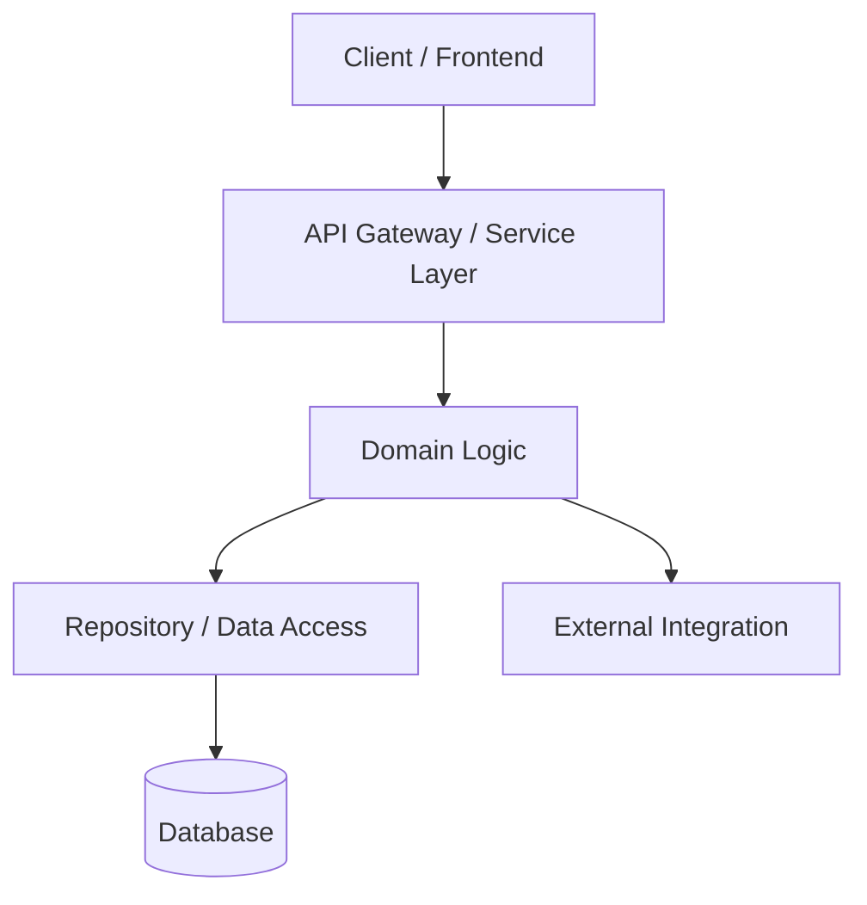

# Inception: Architecture & Technical Design

The **Architecture & Design** stage defines the structural blueprint and contracts for the system under construction.

---

## 1. Objectives

- Select appropriate design patterns, libraries, and communication protocols.
- Model data schemas, domain entities, and API contracts.
- Document trade-offs, risks, and alternatives considered.
- Produce a clear `aidlc-docs/architecture.md` document.

---

## 2. Structure of `aidlc-docs/architecture.md`

```markdown
# Architecture & Technical Design

## 1. System Overview & Component Diagram


## 2. Component Boundaries & Responsibilities
- **Component A (`src/modules/auth`)**: Handles credential verification and token issuance.
- **Component B (`src/modules/billing`)**: Interacts with payment gateway and maintains invoice ledger.

## 3. Data Models & Schema Design
```typescript
interface UserProfile {
  id: string;
  email: string;
  createdAt: Date;
  role: 'admin' | 'user';
}
```

## 4. API Contracts & Interfaces
- `POST /api/v1/auth/login`: Expects `{ email, password }`, returns `{ token, expiresIn }`.
- Error schemas adhere to RFC 7807 (Problem Details).

## 5. Architectural Trade-offs & Decisions (ADRs)
- **Decision**: Use SQLite for local development and PostgreSQL for production.
- **Rationale**: Minimal local footprint while maintaining SQL compliance.
- **Trade-off**: Requires dialect abstraction layer.

## 6. Security & Failure Modes
- Rate limiting: 100 requests per minute per IP.
- Circuit breaker on external API calls with 3s timeout.
```

---

## 3. Cloud & Framework Neutrality
 
- Avoid vendor-locked services when standard open interfaces (e.g., standard SQL, OpenTelemetry, S3-compatible storage, REST/gRPC) can be used.
- Explicitly isolate cloud-provider specific adapters behind domain interfaces.

---

## 4. Human Refinement & Architecture Approval Gate

1. **Evaluate Alternatives Openly**:
   - Present at least one alternative design when making significant architectural choices.
   - Explain why the chosen pattern was favored and what trade-offs it brings (complexity vs. speed, flexibility vs. overhead).
2. **Review Data Contracts with the Developer**:
   - Validate schema definitions, API routes, and error envelopes with the user before finalizing `aidlc-docs/architecture.md`.
3. **Hard Stop Before Implementation**:
   - Do NOT write temporary implementation files, prototype code, or placeholder modules in the codebase during architecture design.
   - The architecture artifact must be reviewed alongside requirements before the human gives clearance for Phase 2 (Construction).

